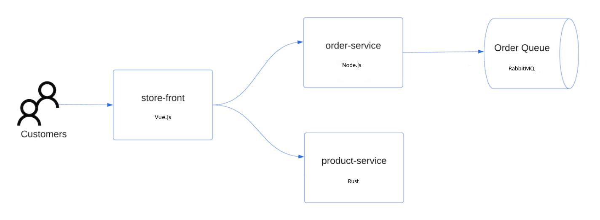
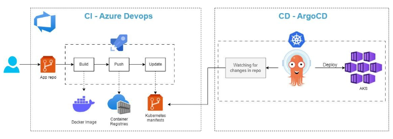

# Part 19: Deploying microservice applications in AKS using Helm Chat and Azure Pipeline(Dynamically update the image tag in values.yaml)

    Part1:   Manual Deployment (AzCLI + Docker Desktop + kubectl)  
    GitHub:  https://github.com/santosh-gh/k8s-01
    YouTube: https://youtu.be/zoJ7MMPVqFY

             - Good for learning and small projects.
             - Error-prone due to manual steps.
             - Not scalable for teams or large projects.

    Part2:   Automated Deployment (AzCLI + Docker + kubect + Azure Pipeline)
    GitHub:  https://github.com/santosh-gh/k8s-02
    YouTube: https://youtu.be/nnomaZVHg9I

            - Faster, repeatable deployments.
            - Reduces human error.
            - Integrates CI/CD best practices.

    Part3:   Automated Infra Deployment (Bicep + Azure Pipeline)
    GitHub:  https://github.com/santosh-gh/k8s-03
    YouTube: https://www.youtube.com/watch?v=5PAdDPHn8F8

    Part4:   Manual Deployment (AzCLI + Docker Desktop + Helm charts + kubectl) 
    GitHub:  https://github.com/santosh-gh/k8s-04
    YouTube: https://www.youtube.com/watch?v=VAiR3sNavh0

             - need to maintain separate files for each environment.
             - No concept of packaging/distribution.
             - no built-in rollback or release tracking.

    Part5:   Automated Deployment (AzCLI + Docker + Helm charts + kubectl + Azure Pipeline) 
    GitHub:  https://github.com/santosh-gh/k8s-04
    YouTube: https://www.youtube.com/watch?v=MnWe2KGRrxg&t=883s

             - Helm uses templates and values (values.yaml) ? same chart can deploy multiple 
               environments (dev, staging, prod) with different configs.
             - Helm packages apps as charts, which can be versioned, shared, and 
               stored in repositories (like Docker images).
             - Helm tracks releases ? easy to upgrade, rollback, and list installed versions 
               (helm upgrade, helm rollback).               
             - Helm can bundle multiple Kubernetes resources (Deployments, Services, Ingress, ConfigMaps, etc.) 
               into a single chart ? deploy everything with one command.

    Part6:   Automated Deployment (AzCLI + Docker + Helm charts + kubectl + Azure Pipeline) 
             Dynamically update the image tag in values.yaml
    GitHub:  https://github.com/santosh-gh/k8s-06
    YouTube: https://www.youtube.com/watch?v=Nx0defm8T6g&t=11s

    Part7:   Automated Deployment (AzCLI + Docker + Helm charts + kubectl + Azure Pipeline)
             Store the helm chart in ACR
             Dynamically update the image tag in values.yaml
             Dynamically update the Chart version in Chart.yaml

    GitHub:  https://github.com/santosh-gh/k8s-07
    YouTube: https://www.youtube.com/watch?v=Y3RaxSZNTaU&t=1s

    Part8:   Automated Deployment (AzCLI + Docker + Helm charts + kubectl + Azure Pipeline)
             Store the helm chart in ACR
             Dynamically update the image tag in values.yaml
             Dynamically update the Chart version in Chart.yaml
             Deploy into multiple environments (dev, test, prod) with approval gates

    GitHub:  https://github.com/santosh-gh/k8s-08
    YouTube: https://www.youtube.com/watch?v=oNysAAGijGk&t=43s

    Part9:   Manual Deployment (AzCLI + Docker + kustomize + kubectl)          
             Deploy into multiple environments (dev, test, prod) through command line

    GitHub:  https://github.com/santosh-gh/k8s-09
    YouTube: https://www.youtube.com/watch?v=Jtz1KldOPAA&t=1s

             - Overlay-based approach makes managing multiple environments (dev, staging, prod) 
               straightforward via Git branches/overlays.

    Part10:  Automated Deployment (AzCLI + Docker + kustomize + kubectl + Azure Pipeline)          
             Deploy into multiple environments (dev, test, prod) through automated pipeline

    GitHub:  https://github.com/santosh-gh/k8s-10
    YouTube: https://www.youtube.com/watch?v=m5ZXmOk0IBs&t=43s

    Part11:  Manual Deployment (AzCLI + Docker + Helm + kustomize + kubectl)          
             Deploy into multiple environments (dev, test, prod) using command line tools.

             - Helm = packaging + release mgmt (install/upgrade/rollback)
             - Kustomize = environment overlays (patches/config differences)
             - Together = scalable, reusable, environment-flexible microservice deployment strategy

    GitHub:  https://github.com/santosh-gh/k8s-11
    YouTube: https://www.youtube.com/watch?v=ZNHoZ_b85DQ&t=1s

    Part12:  Automated Deployment (AzCLI + Docker + Helm + kustomize + kubectl)
             Template First approach 
             Dynamically update the image tag in deploy.yaml         
             Deploy into multiple environments (dev, test, prod) using Azure Pipeline.

    GitHub:  https://github.com/santosh-gh/k8s-12
    YouTube: https://www.youtube.com/watch?v=qxJyTHzWG4U

    Part13:  Manual Deployment (AzCLI + Docker + Helm + kustomize + kubectl)
             Overlay First approach             
             Deploy into multiple environments (dev, test, prod) thorough commands.

    GitHub:  https://github.com/santosh-gh/k8s-13
    YouTube: https://www.youtube.com/watch?v=9uAM8FgNGmI&t=113s

    Part14:  Automated Deployment (AzCLI + Docker + Helm + kustomize + kubectl)
             Overlay First approach             
             Deploy into multiple environments (dev, test, prod) thorough Azure Pipeline.

    GitHub:  https://github.com/santosh-gh/k8s-14
    YouTube: https://www.youtube.com/watch?v=VAiR3sNavh0

    Part15: ArgoCD (Create Argo CD app using UI and Dashboard)
            Create Argo CD applications using Argo CD UI and Dashboard 

            Manual methods: Best for learning, experimentation, and very small projects.
            Automated methods: Best for production, team collaboration, and scaling.   

            kubectl: Simple no extra tools or templating engines needed.

            Helm:  Best for packaging, reusability, upgrades and rollbacks.                    
                can use reusable and ready-made chart.

            Kustomize: Best for environment-specific overlays without duplicating YAML.
                    Patch existing YAMLs for different environments.
                    Powerful when you need to tweak a vendor Helm chart

            Helm + Kustomize: Very flexible, but complex; fits for large enterprises.

            # Traditional Deployment: PUSH Approach

              - Requires the pipeline runner or command line to have cluster credentials
              - The live state may drift from the intended state
              - Rollback means re-running a previous pipeline, manually applying manifests, or 
                keeping Helm release history.
              - Usually requires custom scripting to target multiple clusters (e.g., staging, prod).

            # GitOps(ArgoCD) Deployment: PULL Approach
              
              - Runs inside the cluster and pulls changes from Git.
              - Git is the single source of truth for manifests.
                Detects drift and can automatically fix it.
              - Simply revert the Git commit, Argo syncs back to the previous state.
              - Can promote changes from dev -> test -> prod simply by managing Git branches or directories.
              - Provides a dashboard/UI showing real-time status (Healthy, OutOfSync, Degraded).

    GitHub:  https://github.com/santosh-gh/k8s-15  
    YouTube: https://www.youtube.com/watch?v=Cnt5RZ5m3l8&list=PLr6ErUeFySVug9VG73_W2MypRez_ZycWh&index=15

    Part16: ArgoCD (Create Argo CD app using UI and Dashboard, continue on Part15)
            Create Argo CD applications using Argo CD UI and Dashboard
    GitHub:  https://github.com/santosh-gh/k8s-16
    YouTube: https://www.youtube.com/watch?v=GYMY4ZQ7V9o&list=PLr6ErUeFySVug9VG73_W2MypRez_ZycWh&index=16

    Part17: ArgoCD (Create Argo CD app using manifest)
            Create Argo CD applications using manifests (CRD - Application)
    GitHub:  https://github.com/santosh-gh/k8s-17
    YouTube: https://www.youtube.com/watch?v=W-s6A61w7BI&list=PLr6ErUeFySVug9VG73_W2MypRez_ZycWh&index=17

    
    Part18: ArgoCD (Create Argo CD app using manifest)
            Create Argo CD applications using manifests
            Create Argo CD applications using manifests (CRD - ApplicationSet)
    GitHub:  https://github.com/santosh-gh/k8s-18
    YouTube: https://www.youtube.com/watch?v=GYMY4ZQ7V9o&list=PLr6ErUeFySVug9VG73_W2MypRez_ZycWh&index=16

    Part19: ArgoCD (Automate deployment using Azure Pipeline)
            Create Argo CD applications using manifests
            Automate deployment using Azure Pipeline

    GitHub:  https://github.com/santosh-gh/k8s-19-development.git     
    GitHub:  https://github.com/santosh-gh/k8s-19-deployment.git
    YouTube: https://www.youtube.com/watch?v=GYMY4ZQ7V9o&list=PLr6ErUeFySVug9VG73_W2MypRez_ZycWh&index=16

# Architesture

    # Store front: Web application for customers to view products and place orders.
    # Product service: Shows product information.
    # Order service: Places orders.
    # RabbitMQ: Message queue for an order queue.

# Tetechnology Stack

    Azure Pipelines
    Infra (AzCLI/Bicep)
    AKS
    ACR
    HelmChart
    Argo CD

# Pipeline and Argo CD

# Steps

    1. Infra deployment using AzCLI/Bicep command line 
       OR 
       Pipelines azcli-infra-pipeline.yml/bicep-infra-pipeline.yml

       Infra deployment using AzCLI command line

        a. Login to Azure

            az login
            az account set --subscription=<subscriptionId>
            az account show

        b. Show existing resources

            az resource list

        c. Create RG, ACR and AKS

            # AzCLI
            ./infra/azcli/script.sh

            OR

            # Bicep
            az deployment sub create --location uksouth --template-file ./infra/bicep/main.bicep --parameters ./infra/bicep/main.bicepparam

        d. Connect to cluster

            RESOURCE_GROUP="rg-onlinestore-dev-uksouth-001"
            AKS_NAME="aks-onlinestore-dev-uksouth-001"
            az aks get-credentials --resource-group $RESOURCE_GROUP --name $AKS_NAME --overwrite-existing           

        e. Short name for kubectl

            alias k=kubectl

        d. Show all existing objects

            k get all

    2. Install and Access Argo CD

        a. Create namespace for Argo CD

            kubectl create namespace argocd

        b. Install Argo CD

            kubectl apply -n argocd -f https://raw.githubusercontent.com/argoproj/argo-cd/stable/manifests/install.yaml

        c. Expose Argo CD API server

            kubectl port-forward svc/argocd-server -n argocd 8080:443

        d. Get initial admin password

            kubectl get secret argocd-initial-admin-secret -n argocd \
              -o jsonpath="{.data.password}" | base64 -d; echo

        e. Browse and Login

            https://localhost:8080/

        f. Login to Argo CD from command line

            argocd login localhost:8080 --username admin --password rb2P8Sr-7VPxYD6j --insecure    
        
        g. Add Git Repository to Argo CD

            argocd repo add https://github.com/santosh-gh/k8s-19-deployment.git \
            --username santosh-gh \
            --password GitHub@2025 --insecure-skip-server-verification

            argocd repo add https://github.com/santosh-gh/k8s-19-deployment.git

    2. Run CI Pipelines

            config.yml
            rabbitmq.yml
            order-pipeline.yml
            product-pipeline.yml
            store-front-pipeline.yml

        a. Build and push images to ACR
           
        b. Upadate image tag with Build Id

        c. Update Helm values.yaml in GitOps repository (k8s-19-deployment) 
           
           Argo CD will pull the images from ACR and deploy into AKS

    5. Validate and Access the application

    6. Clean the Azure resources

# Verify the Deployment

    k get pods
    k get services
    curl <LoadBalancer public IP>:80
    Browse the app using http://<LoadBalancer public IP>:80

# Clean the Azure resources

    az group delete --name rg-onlinestore-dev-uksouth-001 --yes --no-wait

    acronlinestoredevuksouth001.azurecr.io